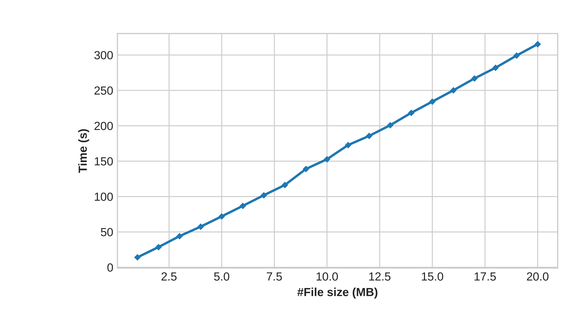

# OPST
Before compiling and running, please install [sdsl](https://github.com/simongog/sdsl-lite/tree/master).
```bash
./pre-install.sh
```


## Compile and run

```bash 
./run.sh
```

It will run on ecg_1_to_40.txt_merged20.txt ~ ecg_1_to_40.txt_merged100.txt, correpsonding to 20 to 100 MB files. 


You can easily specify parameters, for example:

```bash 
./my_program -f ecg_1_to_40.txt_merged20.txt -r 256 -t 2
```
-f specifies the file path;   
-r specifies  "the range of (a,b) determines calling the naive or wavelet tree method", the default value is 512;   
-t specifies the value of minimal support, tau > 1.  

## Print Out Information

Suffix tree is constructed based on w = 12442551 
--------------------------------------------Information Board--------------------------------------------------------  
Sigma of input = 4  
n = 8  
Terminate_label $ = 91  
The number of middle_implicit_ma  x appeared: 1  
In succinct log mode.  
Using std::unordered_map  
Not using safe check  
Tau is set as 2.  
If the range of LastCode input (a, b) , namely b - a < 512, it utilizes the naive way to compute (p(w), s(w)).  
Runtime for wavelet tree construction  = 0.009 s.  
Runtime for suffix tree construction  = 0 s.  
Total runtime for wavelet tree and suffix tree construction  = 0.009 s.  
Runtime used for find 2-maximal order-preserving 2-frequent patterns: 0 s.  
Pattern found at interval: [1, 3]  
Pattern found at interval: [2, 4]  


## Datasets
We uploaded the datasets to [Google Drive](https://drive.google.com/file/d/1eAJr_UHhCpWPiZ_a-rC9WOwWO3Rf3txp/view).


## Tips
We can print the detailed information by setting:
```cpp
-DVERBOSE
```
We do some safe checks by setting:
```cpp
-DCHECK
```

We can visulize the suffix tree via Graphviz by setting:
```cpp
-VISUALIZATION
```
and then 
```bash 
dot -Tpdf pic_nosufL -o suffix_tree_nosuf.pdf  
dot -Tpdf pic_sufL -o suffix_tree_suf.pdf
```


Using unordered_dense from [here](https://github.com/martinus/unordered_dense/tree/main) by setting the following flag. Otherwise, it will utilize std::unordered_map.
```cpp
-DUNORDERED_DENSE
```


The time curve with increasing the file size from 1MB to 20MB:



